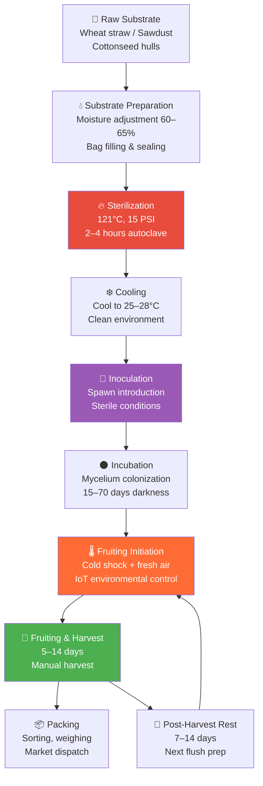
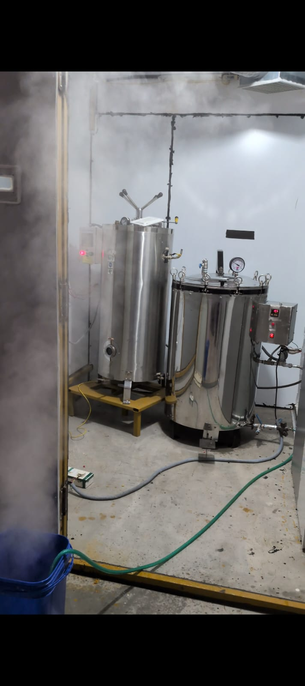
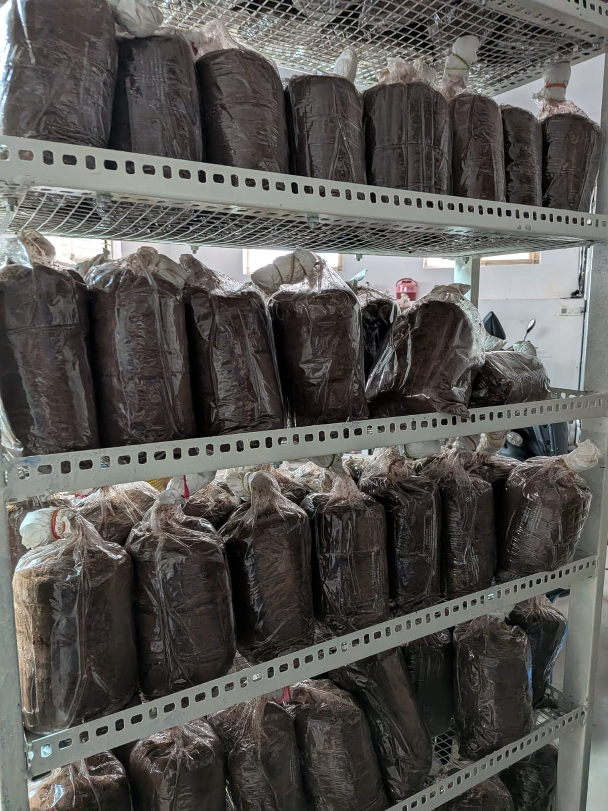
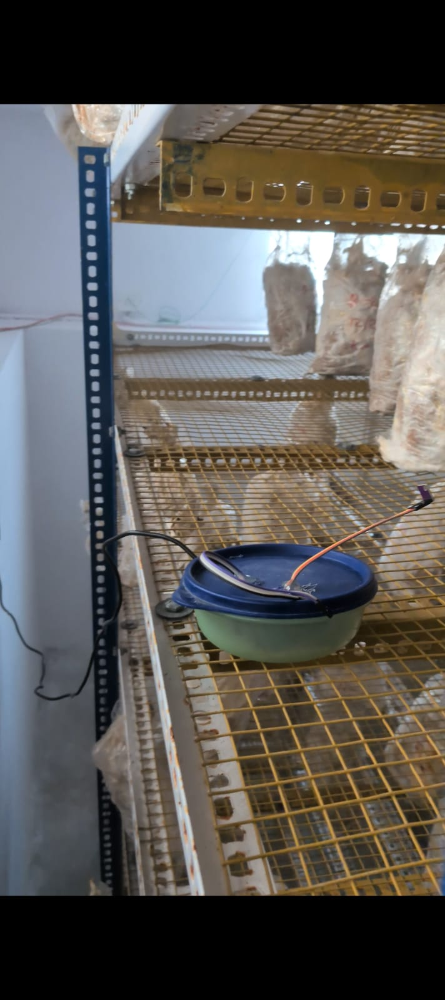
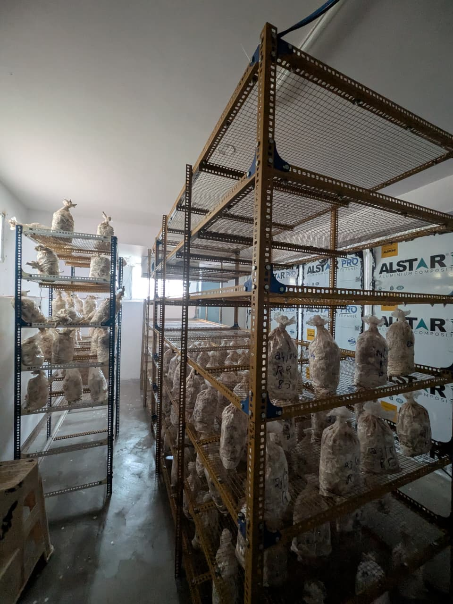
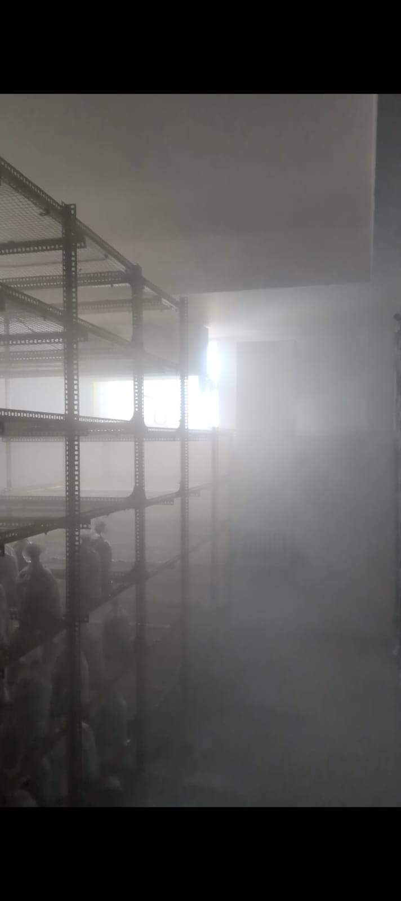
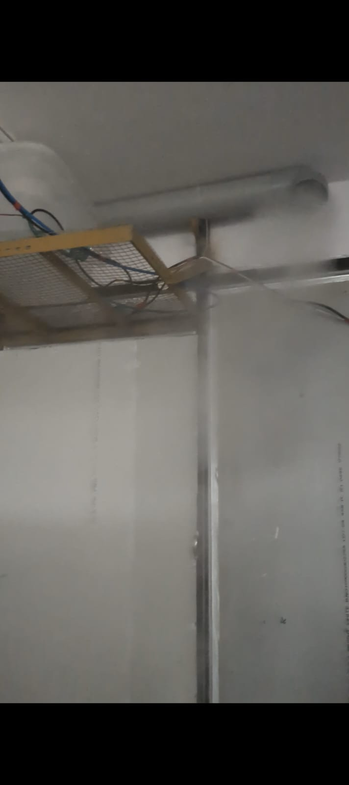
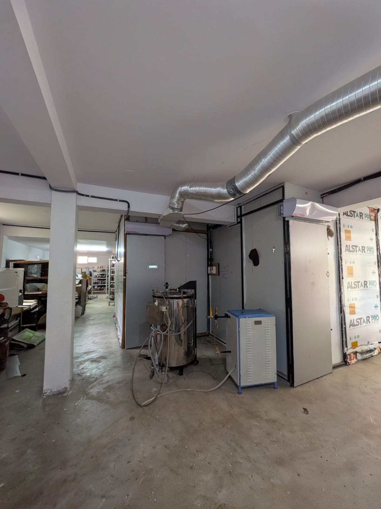
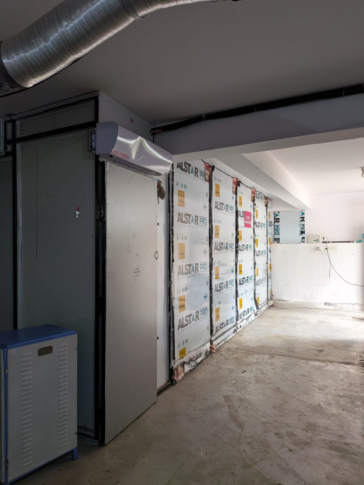

```
 ██████╗██╗      ██████╗ ██╗   ██╗██████╗     ███╗   ███╗██╗   ██╗███████╗██╗  ██╗██████╗  ██████╗  ██████╗ ███╗   ███╗
██╔════╝██║     ██╔═══██╗██║   ██║██╔══██╗    ████╗ ████║██║   ██║██╔════╝██║  ██║██╔══██╗██╔═══██╗██╔═══██╗████╗ ████║
██║     ██║     ██║   ██║██║   ██║██║  ██║    ██╔████╔██║██║   ██║███████╗███████║██████╔╝██║   ██║██║   ██║██╔████╔██║
██║     ██║     ██║   ██║██║   ██║██║  ██║    ██║╚██╔╝██║██║   ██║╚════██║██╔══██║██╔══██╗██║   ██║██║   ██║██║╚██╔╝██║
╚██████╗███████╗╚██████╔╝╚██████╔╝██████╔╝    ██║ ╚═╝ ██║╚██████╔╝███████║██║  ██║██║  ██║╚██████╔╝╚██████╔╝██║ ╚═╝ ██║
 ╚═════╝╚══════╝ ╚═════╝  ╚═════╝ ╚═════╝     ╚═╝     ╚═╝ ╚═════╝ ╚══════╝╚═╝  ╚═╝╚═╝  ╚═╝ ╚═════╝  ╚═════╝ ╚═╝     ╚═╝
                              C U L T I V A T I O N   G U I D E
               🍄  Mycology · Facility Design · Substrate Science · Commercial Strategy
```

---

# Cloud Mushroom — Cultivation Guide

### Mushroom Biology, Farm Operations & Commercial Strategy
**Cloud Mushroom, Mysuru, Karnataka, India**

> *A scientifically grounded guide to commercial King Oyster and Shiitake cultivation — written for operators, investors, and agricultural professionals.*

---

## 📋 Table of Contents

1. [About Cloud Mushroom](#1-about-cloud-mushroom)
2. [Why King Oyster & Shiitake — Not Button Mushrooms](#2-why-king-oyster--shiitake--not-button-mushrooms)
3. [Cultivation Pipeline Overview](#3-cultivation-pipeline-overview)
4. [Cultivation Stages & Environmental Parameters](#4-cultivation-stages--environmental-parameters)
5. [Facility Layout & Infrastructure](#5-facility-layout--infrastructure)
6. [The Role of the IoT System](#6-the-role-of-the-iot-system)
7. [Commercial Viability Analysis](#7-commercial-viability-analysis)
8. [Troubleshooting Common Cultivation Issues](#8-troubleshooting-common-cultivation-issues)
9. [References & Further Reading](#9-references--further-reading)
10. [Contributing](#10-contributing)
11. [License](#11-license)

---

## 1. About Cloud Mushroom

**Cloud Mushroom** is a commercial mushroom cultivation startup based in **Mysuru, Karnataka, India**. The business focuses on the controlled-environment cultivation of two premium fungal species:

- 🍄 **King Oyster** (*Pleurotus eryngii*) — dense, meaty, long-shelf-life fruiting bodies prized by restaurants and premium retail
- 🍄 **Shiitake** (*Lentinula edodes*) — the world's second-most cultivated mushroom, with significant medicinal and nutraceutical market value

The strategic choice of these species over commodity button mushrooms (*Agaricus bisporus*) reflects a deliberate positioning toward the **premium specialty fungi market** — a segment that commands 3–6× higher prices, tolerates smaller production volumes, and is well-matched to the controlled-environment agriculture (CEA) model where precise environmental regulation is the primary operational lever.

### Facility Summary

| Feature | Detail |
|---------|--------|
| Location | Mysuru, Karnataka, India |
| Fruiting Rooms | 2 × insulated cold rooms (~150 sq ft each) |
| Incubation/Growing Rooms | 2 × ambient-temperature rooms |
| Sterilization | 1 × dedicated room with dual industrial autoclaves |
| Packing Area | 1 × sorting, weighing, and packaging zone |
| Species | *Pleurotus eryngii* (King Oyster) + *Lentinula edodes* (Shiitake) |
| Automation | Full IoT environmental control in fruiting rooms |
| Infrastructure | ALSTAR PRO insulated panel rooms, HVAC ducting, SSR + relay actuators |

---

## 2. Why King Oyster & Shiitake — Not Button Mushrooms

This is one of the most important strategic decisions for any new mushroom cultivation business. The answer lies in unit economics, facility requirements, market positioning, and the nature of the product itself.

### Button Mushroom (*Agaricus bisporus*) — Why NOT

| Factor | Reality |
|--------|---------|
| **Market pricing** | ₹80–120/kg — heavily compressed commodity market |
| **Shelf life** | 3–5 days post-harvest — extremely tight logistics window |
| **Substrate** | Composted horse/poultry manure — odorous, complex multi-stage preparation |
| **Scale requirement** | Requires tonnes per day production to generate meaningful daily revenue |
| **Differentiation** | Near-zero — identical product from thousands of suppliers across India |
| **Profit margin** | 10–20% after input costs at small scale |
| **Minimum viable scale** | ~500 sq ft farm yields ~40 kg/day × ₹100/kg = ₹4,000/day gross — marginal |

Button mushrooms are a mass-market commodity. Competing in that market as a small startup means fighting against large, established producers with lower per-unit costs. The short shelf life creates brutal logistics pressure and post-harvest losses that further erode margins. For a small operation in a city like Mysuru, the unit economics simply do not work.

### King Oyster (*Pleurotus eryngii*) — Why YES

| Factor | Reality |
|--------|---------|
| **Market pricing** | ₹300–600/kg — premium specialty market |
| **Shelf life** | 14–21 days refrigerated — dramatically reduced post-harvest pressure |
| **Substrate** | Pasteurized wheat straw / cottonseed hulls / sawdust — simpler, odour-free |
| **Scale requirement** | 200 blocks in 150 sq ft → 60 kg/flush × ₹500/kg = ₹30,000/flush |
| **Biological efficiency** | 80–120% BE achievable on optimised substrate |
| **Market positioning** | Restaurants, specialty retail, direct-to-consumer — premium buyers |
| **Room footprint** | 100–200 sq ft per fruiting room → capital-light |

*Pleurotus eryngii* is native to the Mediterranean and Central Asian steppes. In India, it is a premium import that commands restaurant-grade pricing. Its dense, meaty fruiting bodies with white caps and thick stems have excellent culinary value and a shelf life of up to 3 weeks under refrigeration — meaning a small producer can serve restaurant accounts without the next-day logistics pressure that commodities demand.

### Shiitake (*Lentinula edodes*) — Why YES

| Factor | Reality |
|--------|---------|
| **Market pricing** | ₹400–800/kg fresh; ₹2,000–4,000/kg dried |
| **Global demand** | 2nd most cultivated mushroom globally (after button) |
| **Medicinal value** | Lentinan (immunomodulatory polysaccharide), eritadenine (cholesterol-lowering) |
| **Nutraceutical market** | Premium dried Shiitake commands export-grade pricing |
| **Shelf life** | 10–14 days fresh; months when dried |
| **Substrate** | Hardwood sawdust supplemented blocks |
| **Revenue per sq ft** | Highest of all commonly cultivated species at small scale |

Shiitake carries a dual market opportunity: fresh produce for local restaurants and retail, and dried/processed product for nutraceutical and export markets. The medicinal reputation of Shiitake (backed by substantial peer-reviewed research on lentinan and eritadenine) allows premium pricing in health-conscious consumer segments that button mushrooms cannot access.

### Side-by-Side Comparison

| Metric | Button Mushroom | King Oyster | Shiitake |
|--------|----------------|-------------|----------|
| Price/kg (fresh) | ₹80–120 | ₹300–600 | ₹400–800 |
| Shelf life | 3–5 days | 14–21 days | 10–14 days |
| Substrate complexity | High (composted manure) | Low–Medium | Medium |
| Min viable scale | Very large | Small–Medium | Small–Medium |
| Differentiation potential | Very low | High | Very high |
| CEA suitability | Medium | Excellent | Excellent |
| Revenue/flush (200 blocks) | ₹8,000–12,000 | ₹25,000–45,000 | ₹30,000–60,000 |

**Conclusion:** For a CEA startup in an Indian city, King Oyster and Shiitake offer 3–5× the revenue per square foot of button mushrooms, with lower substrate complexity, better shelf life, and access to premium market channels that are not available to commodity producers.

---

## 3. Cultivation Pipeline Overview



> 🔴 **The orange node (Fruiting Initiation) is the critical IoT-controlled stage.** All sensor measurements and actuator decisions by the Cloud Mushroom Operations Centre target this phase.

---

## 4. Cultivation Stages & Environmental Parameters

### Stage 1 — Substrate Preparation & Sterilization

**What happens biologically:** The substrate (cellulosic agricultural byproducts) is the food source for the fungal mycelium. Before inoculation, all competing microorganisms — bacteria, moulds, wild yeasts — must be eliminated. Sterilization at 121°C and 15 PSI for 2–4 hours denatures proteins in all mesophilic and thermophilic organisms, creating a sterile medium that the introduced mushroom spawn can colonize without competition.

Moisture content is critical: 60–65% for King Oyster, 55–62% for Shiitake. Too dry and mycelial growth stalls; too wet and anaerobic bacteria thrive and cause contamination.


*Cloud Mushroom sterilization room: dual stainless steel autoclaves — a large-capacity cylindrical pressure vessel and a tall upright autoclave — for substrate sterilization at 121°C, 15 PSI. Steam visible indicates active sterilization cycle.*

| Parameter | King Oyster | Shiitake |
|-----------|-------------|----------|
| Substrate | Wheat straw / cottonseed hulls | Hardwood sawdust + wheat bran |
| Moisture content | 60–65% | 55–62% |
| Sterilization method | Autoclave (pressure vessel) | Autoclave |
| Sterilization temperature | 121°C | 121°C |
| Sterilization pressure | 15 PSI | 15 PSI |
| Duration | 2–3 hours | 3–4 hours |
| Cooling target before inoculation | 25–28°C | 25–28°C |
| Bag type | Polypropylene (PP) heat-resistant | Polypropylene (PP) |

---

### Stage 2 — Inoculation

**What happens biologically:** Once the substrate is sterilized and cooled, mushroom spawn (mycelium pre-grown on grain or sawdust) is introduced into each bag. The mycelium begins extending hyphae through the substrate, enzymatically breaking down lignocellulosic material to extract carbon and nitrogen. The first 48–72 hours are the highest-risk period — any airborne contamination before the mycelium establishes dominance can result in total bag loss.

| Parameter | King Oyster | Shiitake |
|-----------|-------------|----------|
| Spawn rate | 5–10% of dry substrate weight | 10–15% |
| Spawn type | Grain spawn or wheat straw spawn | Sawdust spawn or plug spawn |
| Inoculation environment | Clean room / still-air box / LAF bench | Same |
| Contamination risk window | High (first 48 hrs) | High (first 72 hrs) |
| Signs of successful colonization | White mycelial threads visible in 3–5 days | Visible in 5–10 days |
| Indicator of contamination | Green, black, or pink patches | Same |

---

### Stage 3 — Incubation / Colonization

**What happens biologically:** Inoculated bags are moved to the incubation room and kept in darkness. The mycelium grows through the substrate over weeks, digesting lignocellulose via secreted enzymes (laccases, peroxidases, cellulases). The substrate visibly transitions from its original colour to dense white mycelial mass. CO₂ is produced continuously as a metabolic byproduct — high CO₂ during this stage is tolerated and even beneficial, as it suppresses competing organisms and promotes vegetative mycelial growth over premature fruiting.


*Incubation room: dark-coloured sawdust substrate blocks in polypropylene bags stacked on shelving racks — mycelium fully colonizing in controlled darkness. The black/brown colour is characteristic of sawdust substrate; healthy white mycelium is visible at bag edges.*

| Parameter | King Oyster | Shiitake |
|-----------|-------------|----------|
| Temperature | 22–26°C | 20–26°C |
| Humidity (ambient) | 70–80% RH | 70–80% RH |
| CO₂ level | <5000 ppm (high CO₂ tolerated) | <5000 ppm |
| Light | None required | None required |
| Air exchange | Minimal | Minimal |
| Duration to full colonization | 15–25 days | 40–70 days |
| Signs of complete colonization | Substrate fully white, firm block | Same + slight browning (hyphal knots) |

---

### Stage 4 — Fruiting Initiation (Primordia Formation)

**What happens biologically:** This is the most environmentally sensitive stage and the primary target of the Cloud Mushroom IoT system. Once the substrate block is fully colonized, it must receive environmental cues that trigger the transition from vegetative growth to reproductive fruiting. In nature, this corresponds to the arrival of autumn: lower temperatures, higher humidity, increased fresh air (lower CO₂), and light.

The critical triggers are:
- **Temperature drop** of 5–8°C (cold shock) — signals the onset of autumn conditions
- **High relative humidity** (88–95%) — prevents desiccation of emerging pinheads
- **Low CO₂** (<800 ppm for King Oyster, <1000 ppm for Shiitake) — the most important trigger; elevated CO₂ suppresses primordia formation. Fresh air exchange is the mechanism.
- **Light** (~100–300 lux, 12 hrs/day) — phototropic cue for pin orientation

> 🔴 **This is exactly the stage the Cloud Mushroom Operations Centre automates.** The SHT40 sensor measures RH every 3 seconds. When RH drops below `humLow` (default 75%), the humidifier SSR (GPIO12 on 2B) activates. The MH-Z19E sensor measures CO₂ every 5 seconds. When CO₂ exceeds `co2Limit` (default 1200 ppm), the exhaust fan relay (GPIO14) activates to purge CO₂-laden air and draw in fresh outside air. The 3C master evaluates these conditions every 3 seconds and maintains both parameters within target range 24 hours a day.


*Fruiting room: 2B sensor node placed on the shelf rack among fruiting bags. The SHT40 (temperature/humidity) and MH-Z19E CO₂ sensor are inside a protective bowl enclosure to prevent direct water condensation on electronics while still allowing airflow for accurate readings.*


*Fruiting room with mushroom substrate bags on wire mesh racks — humidifier OFF state. Bags show active colonization with visible mycelial growth.*


*Fruiting room during active humidification — SSR relay triggered by hysteresis control when RH < 88%. Ultrasonic humidifier producing dense mist, filling the fruiting chamber to maintain optimal primordia-formation humidity.*


*Humidifier in full operation: dense mist visible filling the entire fruiting room — system actively maintaining 90–95% RH for primordia development. Shelf rack structure visible through the mist.*

| Parameter | King Oyster | Shiitake |
|-----------|-------------|----------|
| Temperature | 14–18°C | 12–16°C |
| Humidity (RH) | **88–95%** | **85–92%** |
| CO₂ level | **<800 ppm** | **<1000 ppm** |
| Light | 12 hrs/day, 100–200 lux | 12 hrs/day, 100–300 lux |
| Air exchange | 4–6 changes/hour | 4–6 changes/hour |
| Misting frequency | 3–5× daily (or continuous hysteresis) | 2–4× daily |
| Duration to visible pins | 5–10 days | 7–14 days |
| Cold shock required | Yes (5–8°C drop) | Yes |

---

### Stage 5 — Fruiting & Harvest

**What happens biologically:** Primordia (pins) develop into mature fruiting bodies over 5–7 days. The mycelium transports water and nutrients from the substrate colonized mass into the growing fruiting body. Environmental parameters shift slightly from the initiation stage — slightly higher CO₂ tolerance is acceptable once pins are established, but humidity must remain high to prevent cracking and drying of the developing caps.

Harvest timing is critical for shelf life and buyer quality standards:
- **King Oyster:** Harvest before the cap fully flattens — when the cap is still slightly inrolled at the edges. Post-this point, shelf life drops rapidly.
- **Shiitake:** Harvest before the veil tears — when the cap has opened but the partial veil connecting cap edge to stem is still intact.


*Fruiting room exterior view: insulated cold room panels (ALSTAR PRO aluminum composite), HVAC ducting running overhead, air handling unit mounted above the door — purpose-built infrastructure for precise temperature control throughout the fruiting cycle.*


*Multiple independent fruiting chambers in a row: separate temperature-controlled rooms allow staggered crop cycles — one room at fruiting initiation while another is at peak harvest — enabling continuous year-round production without gaps.*

| Parameter | King Oyster | Shiitake |
|-----------|-------------|----------|
| Temperature | 15–20°C | 14–18°C |
| Humidity (RH) | 85–92% | 80–90% |
| CO₂ level | <1000 ppm | <1200 ppm |
| Harvest timing | Before cap flattens | Before veil tears |
| Biological Efficiency (BE) | 80–120% | 40–80% |
| Flushes per block | 3–5 | 2–4 |
| Post-harvest rest between flushes | 7–10 days | 10–14 days |
| Total production period per block | 60–90 days | 120–180 days |

> **Biological Efficiency (BE)** = (Fresh weight harvested ÷ Dry weight of substrate) × 100%. A BE of 100% means 1 kg dry substrate yields 1 kg fresh mushrooms.

---

## 5. Facility Layout & Infrastructure

### Sterilization Room

Houses the two industrial sterilization vessels:
- **Large cylindrical pressure tank** — high-volume sterilization for bulk substrate batches
- **Upright autoclave with pressure gauge and digital temperature controller** — precision sterilization with monitored cycle

Both vessels are stainless steel, rated for 15+ PSI operation. The room is maintained at ambient temperature with forced ventilation to accelerate cooling after sterilization cycles. Steam and condensate drainage provisions are built into the floor.

### Inoculation Area

Adjacent to the sterilization room to minimize the substrate transport distance between sterilization and inoculation (reducing contamination exposure time). Positive-pressure airflow or still-air box conditions are maintained. Operators wear sterile gloves, masks, and clean lab coats. All surfaces are wiped with 70% isopropyl alcohol before each session.

### Incubation / Growing Rooms (×2)

Warm, dark rooms maintained at 22–26°C. Wire mesh shelving racks allow stacking of inoculated bags in rows. Minimal air exchange — the high CO₂ environment of incubating bags is not a concern at this stage and a lower air exchange rate reduces contamination risk from airborne spores. Temperature is maintained passively in the Mysuru climate for most of the year; supplemental heating may be required during winter months.

### Fruiting Rooms (×2)

The most technically demanding spaces in the facility:

- **ALSTAR PRO insulated composite panel construction** — excellent thermal insulation (similar to cold room panels), maintains precise temperature with lower HVAC energy consumption
- **Split AC unit** mounted above each room door — primary temperature control, set to 15–18°C for King Oyster fruiting
- **HVAC ducting** — distributes conditioned air uniformly throughout the room volume
- **Ultrasonic humidifier** — controlled by the IoT SSR relay, maintains 88–95% RH
- **Exhaust fan** — controlled by the IoT mechanical relay, purges CO₂-laden air and draws in fresh outside air
- **Wire mesh shelving racks** — open mesh maximizes airflow around every block on every shelf level
- **2B sensor node** — SHT40 + MH-Z19E sensors positioned at mid-shelf height for representative environmental readings

### Packing Room

Post-harvest sorting, quality grading, weighing, and packaging for market dispatch. Substrate blocks awaiting flush completion are also stored here between fruiting cycles. The packing area is maintained at ambient temperature with good ventilation to delay post-harvest deterioration.

---

## 6. The Role of the IoT System

The Cloud Mushroom Operations Centre (documented in `README.md`) exists entirely to serve the fruiting stage described in Stage 4 above. Without automation:

- A worker must check humidity and CO₂ manually every 1–2 hours, including overnight
- Manual switching of the humidifier and fan introduces significant hysteresis variability — the actual RH may swing from 70% to 95%+ between interventions
- Sustained CO₂ above 1500 ppm during primordia formation causes elongated, thin-stemmed fruiting bodies and reduced yields
- A single night of unmonitored low humidity can abort an entire flush of primordia

With the IoT system:

- RH is maintained within ±2–3% of the humLow–humHigh band, 24 hours a day
- CO₂ is actively purged whenever it exceeds the limit, with a 100 ppm deadband preventing relay chatter
- The operator receives real-time status via Telegram from anywhere, with manual override available without physical presence
- Threshold adjustments for different cultivation stages (initiation vs. growth vs. maturation) can be made remotely via `/set` commands

This directly translates to **more consistent pinning, higher biological efficiency, and more predictable flush timing** — the three primary economic drivers of a commercial cultivation operation.

---

## 7. Commercial Viability Analysis

### Revenue Modelling — Per Fruiting Room

Assumptions based on Cloud Mushroom's operational configuration:

| Variable | Value | Notes |
|----------|-------|-------|
| Blocks per room | 200 | Wire mesh 6-shelf rack, 150 sq ft room |
| Substrate dry weight per block | 1.2 kg | Standard 1.5 kg filled bag |
| Biological Efficiency | 90% | Achievable with IoT-maintained environment |
| Fresh yield per block per flush | ~300 g | 1.2 kg × 0.9 BE × ~28% water loss adjustment |
| Total yield per flush (room) | ~60 kg | 200 blocks × 300 g |
| Market price (King Oyster) | ₹500/kg | Restaurant/specialty retail channel |
| **Revenue per flush per room** | **₹30,000** | |
| Flushes per block | 3–4 | Over full production cycle |
| Flush cycle interval | ~30 days | Including rest period |
| **Monthly revenue per room** | **~₹30,000** | 1 flush/month/room |

### Two-Room Staggered Production

With two fruiting rooms running on staggered 15-day offset cycles:

| Week | Room A | Room B | Revenue |
|------|--------|--------|---------|
| 1 | Fruiting initiation | Harvest | ₹30,000 |
| 3 | Harvest | Post-harvest rest / block reload | ₹30,000 |
| 5 | Repeat | Fruiting initiation | ₹30,000 |

**Estimated monthly gross revenue: ₹50,000–70,000** from two rooms in steady-state operation.

### Input Cost Estimate

| Input | Monthly Cost (estimate) |
|-------|------------------------|
| Substrate (wheat straw, sawdust, bran) | ₹8,000–12,000 |
| Spawn | ₹3,000–5,000 |
| Electricity (AC, humidifier, fan, lighting) | ₹4,000–6,000 |
| Packaging materials | ₹2,000–3,000 |
| Labor (part-time, harvest + packing) | ₹6,000–10,000 |
| **Total monthly input costs** | **₹23,000–36,000** |

### Gross Margin

| Scenario | Revenue | Costs | Gross Margin |
|----------|---------|-------|-------------|
| Conservative | ₹50,000 | ₹36,000 | **28%** |
| Target | ₹60,000 | ₹29,000 | **52%** |
| Optimised | ₹70,000 | ₹23,000 | **67%** |

### Why Small Footprint Works

A 300 sq ft fruiting operation (2 × 150 sq ft rooms) generating ₹60,000/month gross revenue represents approximately **₹200/sq ft/month** — a metric that large commodity button mushroom farms operating at tonnes/day would struggle to match. The key drivers:

1. **Price premium** — ₹500/kg vs ₹100/kg for button mushrooms
2. **Shelf life** — 14–21 days means lower post-harvest loss and access to buyers who cannot accept 3-day commodities
3. **Capital efficiency** — two insulated rooms, two relay controllers, and a Telegram bot replace an entire monitoring and labor shift
4. **IoT dividend** — consistent environmental control converts the theoretical BE (90%) into real achieved BE, eliminating the largest source of revenue variability

---

## 8. Troubleshooting Common Cultivation Issues

| Problem | Likely Cause | Diagnosis | Solution |
|---------|-------------|-----------|----------|
| Green or black patches on substrate | *Trichoderma* or *Aspergillus* contamination | Visible within 7–14 days of inoculation | Sterilization failure; insufficient cooling before inoculation; poor LAF conditions. Remove affected bags immediately to prevent spore spread. |
| No pins after 14 days in fruiting room | CO₂ too high (>2000 ppm) or RH too low (<80%) | Check IoT `/status` — verify CO₂ and RH readings | If CO₂ high: confirm exhaust fan is operating. If RH low: confirm humidifier SSR is switching. |
| Elongated, thin-stemmed fruiting bodies | CO₂ elevated (800–1500 ppm) — mycelium grows stems toward "fresh air" | Monitor `/status` CO₂ readings over 24h | Increase air exchange frequency; check if `co2Limit` threshold is set too high; verify fan is actually moving air |
| Cracked or dry caps | RH below 80% during fruiting | Check SHT40 reading; inspect humidifier output | Check SSR relay is switching; verify humidifier water reservoir not empty; inspect ultrasonic transducer |
| Soft, browning, or water-soaked fruiting bodies | Temperature too high (>22°C) or free water on caps | Check room temperature; inspect misting pattern | Verify AC setpoint; if misting directly onto caps, redirect nozzle to floor/walls; check cooler relay |
| Substrate not colonizing after 3 weeks | Spawn killed by heat before inoculation; contamination suppressing mycelium | Open one bag carefully — any colour other than white is contamination | Ensure bags cooled to <28°C (ideally 25°C) before inoculation; verify spawn viability |
| Patchy or uneven colonization | Insufficient mixing during inoculation; substrate too dry or too wet | Visual inspection shows islands of mycelium with dark gaps | Improve spawn distribution technique; recheck substrate moisture calibration |
| CO₂ reads 0 ppm on dashboard | MH-Z19E still in warm-up period (3–5 minutes after power-on) | Send `/link` on Telegram — will show "CO2 warm: YES" | Wait for warm-up to complete; if persistent, check UART wiring (GPIO16/17) |
| Humidity reads 0% or 100% (stuck) | SHT40 I2C communication failure | Check `errorFlags` in `/status` — bit 0 set | Verify SHT40 wiring at GPIO21/22; check 4.7kΩ pull-ups are present; try power cycling 2B |

---

## 9. References & Further Reading

1. **Chang, S.T. & Miles, P.G.** (2004). *Mushrooms: Cultivation, Nutritional Value, Medicinal Effect, and Environmental Impact* (2nd ed.). CRC Press. — Definitive reference covering *Pleurotus* and *Lentinula* cultivation science.

2. **Royse, D.J., Baars, J. & Tan, Q.** (2017). *Current overview of mushroom production in the world.* In: Zied, D.C. & Pardo-Giménez, A. (eds.), *Edible and Medicinal Mushrooms: Technology and Applications*. Wiley-Blackwell. — Global production statistics and species comparison.

3. **Wasser, S.P.** (2002). *Medicinal mushrooms as a source of antitumor and immunomodulating polysaccharides.* Applied Microbiology and Biotechnology, 60(3), 258–274. — Peer-reviewed foundation for Shiitake lentinan medicinal claims.

4. **Kulshreshtha, S., Mathur, N. & Bhatnagar, P.** (2014). *Mushroom as a product and their role in mycoremediation.* AMB Express, 4(1), 29. — Reviews *Pleurotus eryngii* substrate biology and biological efficiency optimization.

5. **Gregori, A., Švagelj, M. & Pohleven, J.** (2007). *Cultivation techniques and medicinal properties of Pleurotus spp.* Food Technology and Biotechnology, 45(3), 238–249. — Detailed King Oyster cultivation parameters including environmental requirements.

6. **Bisko, N.A., Lomberg, M.L., Mytropolska, N.Yu. & Mykchaylova, O.B.** (2016). *The IBK Mushroom Culture Collection*. M.G. Kholodny Institute of Botany. — Strain selection and substrate formulation for *Lentinula edodes*.

7. **FAO** (2021). *Edible Fungi: World Production and Trade, 2019*. Food and Agriculture Organization of the United Nations. — For market context and global demand data. Available at: fao.org

8. **Sánchez, C.** (2010). *Cultivation of *Pleurotus ostreatus* and other edible mushrooms.* Applied Microbiology and Biotechnology, 85(5), 1321–1337. — Substrate science and environmental parameter optimization applicable to *P. eryngii*.

---

## 10. Contributing

This guide is maintained as part of the Cloud Mushroom Operations Centre repository. Contributions from mycologists, agronomists, or controlled-environment agriculture practitioners with field-validated data are welcome via GitHub Issues.

**Areas where expert contributions are especially valuable:**
- *Pleurotus eryngii* strain selection for South Indian climate (Mysuru, Karnataka)
- Substrate formulations using locally available agricultural byproducts (coconut coir, sugarcane bagasse)
- CO₂ and RH sensor calibration protocols in high-humidity fruiting environments
- Post-harvest storage optimization data for the Mysuru/Bengaluru wholesale market

---

## 11. License

```
Copyright © 2026 Nikhil Mahesh
Cloud Mushroom — Cultivation Guide — All Rights Reserved

This document is made available for educational and portfolio reference purposes only.
Unauthorized commercial reproduction, redistribution, or adaptation without explicit
written permission from the author is strictly prohibited.

THE INFORMATION IS PROVIDED "AS IS", WITHOUT WARRANTY OF ANY KIND.
Agricultural outcomes depend on many factors beyond environmental control.
```

---

<div align="center">

**Cloud Mushroom · Mysuru, Karnataka, India · 2026**

*Precision cultivation through precision engineering.*

☁️🍄

</div>
