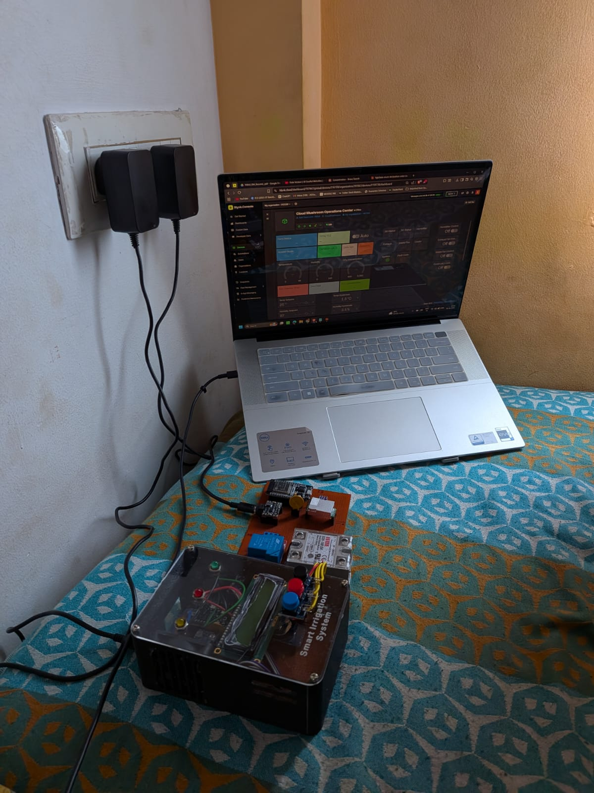
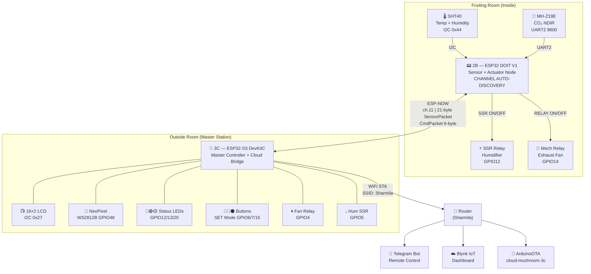
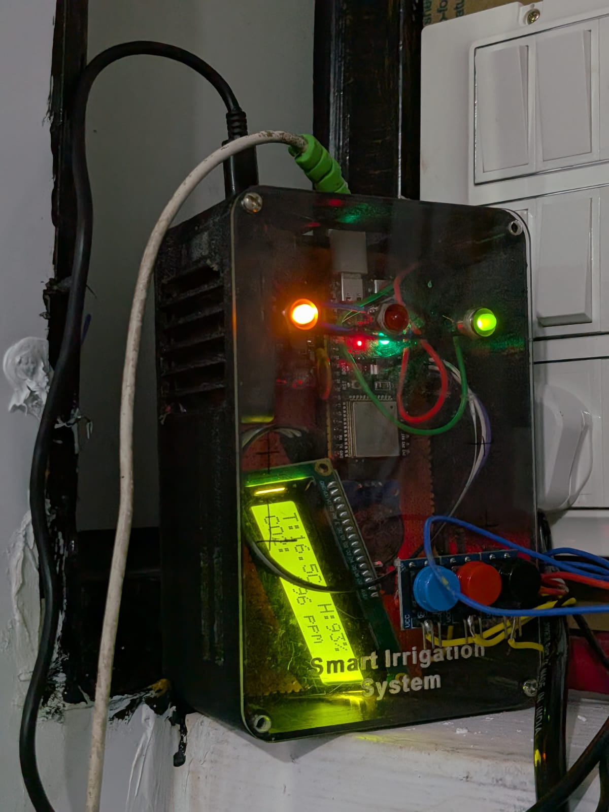
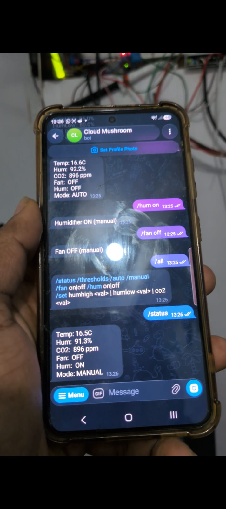
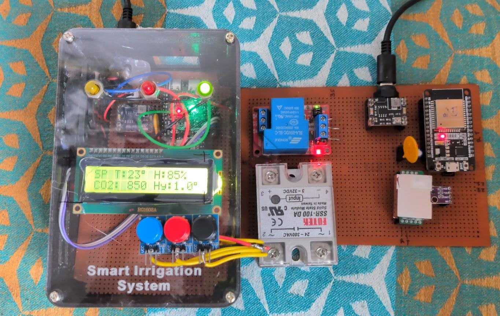

```
 ██████╗██╗      ██████╗ ██╗   ██╗██████╗     ███╗   ███╗██╗   ██╗███████╗██╗  ██╗██████╗  ██████╗  ██████╗ ███╗   ███╗
██╔════╝██║     ██╔═══██╗██║   ██║██╔══██╗    ████╗ ████║██║   ██║██╔════╝██║  ██║██╔══██╗██╔═══██╗██╔═══██╗████╗ ████║
██║     ██║     ██║   ██║██║   ██║██║  ██║    ██╔████╔██║██║   ██║███████╗███████║██████╔╝██║   ██║██║   ██║██╔████╔██║
██║     ██║     ██║   ██║██║   ██║██║  ██║    ██║╚██╔╝██║██║   ██║╚════██║██╔══██║██╔══██╗██║   ██║██║   ██║██║╚██╔╝██║
╚██████╗███████╗╚██████╔╝╚██████╔╝██████╔╝    ██║ ╚═╝ ██║╚██████╔╝███████║██║  ██║██║  ██║╚██████╔╝╚██████╔╝██║ ╚═╝ ██║
 ╚═════╝╚══════╝ ╚═════╝  ╚═════╝ ╚═════╝     ╚═╝     ╚═╝ ╚═════╝ ╚══════╝╚═╝  ╚═╝╚═╝  ╚═╝ ╚═════╝  ╚═════╝ ╚═╝     ╚═╝
                         O P E R A T I O N S   C E N T R E
                    ☁️🍄  Commercial IoT Automation — Mysuru, Karnataka, India
```

---

# Cloud Mushroom — Distributed IoT Microclimate Control System

### Closed-Loop ESP-NOW Sensor-Actuator Network for Commercial Mycological Environment Management


-purple)

---

> **Full-Stack IoT Automation of a Commercial Mushroom Cultivation Startup (Cloud Mushroom, Mysuru) using Edge-Computed Closed-Loop Control, ESP-NOW Telemetry, and OTA-Managed Actuator Sequencing**
>
> *Designed, built, and deployed entirely by a single engineer — hardware, firmware, cloud, and safety.*

---


*Full system: 3C Master enclosure (left, acrylic box with LCD + buttons + LEDs), 2B Slave sensor/relay perfboard (right, with Fotek SSR-100DA and mechanical relay), and Blynk IoT dashboard on laptop during commissioning*

---

## ⚡ Quick Start

```bash
# 1. Clone the repository
git clone https://github.com/yourusername/Cloud-Mushroom-IoT.git

# 2. Configure MACs in both firmware files
#    3C_OTA_V9.ino   → SLAVE_MAC   = {0xD0,0xEF,0x76,0x33,0x69,0x48}
#    2B_final_tele.ino → MASTER_MAC = {0x1C,0xDB,0xD4,0x46,0x22,0x88}

# 3. Flash 2B first (ESP32 DOIT DevKit V1, 115200 baud)
#    Board: "ESP32 Dev Module" | Port: COMx / /dev/ttyUSBx

# 4. Flash 3C (ESP32-S3 DevKitC, 115200 baud)
#    Board: "ESP32S3 Dev Module" | Port: COMx / /dev/ttyUSBx

# 5. Open Serial Monitor on 3C @ 115200
#    Watch for: "WiFi connected", "ESP-NOW init OK", "Peer 2B registered"
#    Send /status on Telegram → verify live readings
```

---

## 📋 Table of Contents

1. [Project Overview](#1-project-overview)
2. [System Architecture](#2-system-architecture)
3. [Hardware](#3-hardware)
4. [Firmware Deep Dive](#4-firmware-deep-dive)
5. [Communication Protocol](#5-communication-protocol)
6. [Telegram Bot Interface](#6-telegram-bot-interface)
7. [OTA Update Guide](#7-ota-update-guide)
8. [Automation Logic](#8-automation-logic)
9. [Setup & Flashing Guide](#9-setup--flashing-guide)
10. [Issues Faced, Lessons Learned & Fixes](#10-issues-faced-lessons-learned--fixes)
11. [Known Limitations & Future Work](#11-known-limitations--future-work)
12. [Repository Structure](#12-repository-structure)
13. [Contributing](#13-contributing)
14. [License](#14-license)

---

## 1. Project Overview

### About Cloud Mushroom

Cloud Mushroom is a commercial mushroom cultivation startup based in Mysuru, Karnataka, India. The facility specializes in premium-grade King Oyster (*Pleurotus eryngii*) and Shiitake (*Lentinula edodes*) mushrooms — species that command 3–6× the market price of commodity button mushrooms while being well-suited for small-footprint, controlled-environment cultivation. The facility comprises two fruiting rooms, two incubation rooms, a sterilization room with industrial autoclaves, and a packing area.

### The Problem

Mushroom cultivation, particularly the fruiting stage, is extraordinarily sensitive to three environmental parameters: **relative humidity (RH)**, **CO₂ concentration**, and **temperature**. King Oyster requires 88–95% RH and CO₂ below 800 ppm to initiate primordia formation. Deviations of even 5% RH or 200 ppm CO₂ for sustained periods can abort an entire flush — representing days of lost yield and input costs. Prior to this system, both parameters were managed manually: a worker would check readings and manually switch the humidifier and exhaust fan on or off. This was inconsistent, labor-intensive, required overnight presence, and was the primary driver of yield variability across flushes.

### The Solution

This project delivers a **two-node ESP32 distributed IoT system** that fully automates environmental control in the fruiting room with no manual intervention required. The **3C node** (ESP32-S3 DevKitC) acts as the master controller and cloud bridge: it runs the automation logic, hosts the Telegram bot for remote control, streams data to the Blynk IoT dashboard, manages the local LCD user interface with physical button-based threshold configuration, and supports OTA firmware updates. The **2B node** (ESP32 DOIT DevKit V1) lives inside the fruiting room and acts as the sensor and actuator node: it reads temperature and humidity (SHT40) and CO₂ (MH-Z19E) every 3–5 seconds and controls the humidifier (via SSR relay) and exhaust fan (via mechanical relay) based on commands from 3C.

The two nodes communicate exclusively via **ESP-NOW** — Espressif's low-latency connectionless 802.11 peer-to-peer protocol — eliminating router dependency for the control path. This means actuator commands are delivered in ~1ms regardless of cloud connectivity status. Cloud connectivity (WiFi, Telegram, Blynk) is handled entirely by 3C and is non-critical for local automation.

### Why This Matters

For a small-scale commercial cultivation operation, environmental control consistency directly translates to yield predictability and profitability. A system that maintains RH within ±2% and CO₂ within ±50 ppm 24/7 — without human presence — eliminates the largest source of crop failure in the fruiting stage. The Telegram bot means the operator can monitor and override the system from anywhere, at any time, from a smartphone. The OTA update capability means firmware improvements can be deployed without physically accessing the controller.

---

## 2. System Architecture

### 2.1 Network Topology



### 2.2 Node Descriptions

#### 3C — Master Controller (ESP32-S3 DevKitC)

The master node is the brain and cloud bridge of the system. It never loses local automation capability even if the internet connection drops, because the automation engine runs entirely on-device using the last received sensor readings.

| Subsystem | Detail |
|-----------|--------|
| WiFi mode | STA — connects to router "Sharmila" |
| ESP-NOW role | Master peer, `peer.channel = 0` (auto, follows STA radio) |
| OTA | ArduinoOTA, hostname `cloud-mushroom-3c`, password `ota1234` |
| Telegram | Long-poll `getUpdates` every 3s |
| LCD | 16×2 I2C (addr 0x27), SDA GPIO8, SCL GPIO9 |
| NeoPixel | WS2812B (GPIO48), 18-state color FSM |
| Buttons | Blue GPIO6 (NEXT/Enter SET), Red GPIO7 (UP), Black GPIO15 (DOWN/Cancel) |
| SET mode | Configure humHigh%, humLow%, CO₂ limit; saved to NVS (Preferences) |
| Fan relay output | GPIO4 (active HIGH) |
| Humidifier SSR | GPIO5 (active HIGH) |
| Status LEDs | Red GPIO12 (alert), Green GPIO13 (all OK), Yellow GPIO20 (AUTO mode) |
| Automation cycle | Every 3s, hysteresis-based, CO₂ deadband 100 ppm |
| Link timeout | 15s without 2B packet → alert state |
| MAC address | `1C:DB:D4:46:22:88` |

#### 2B — Sensor + Actuator Node (ESP32 DOIT DevKit V1)

The slave node lives inside the fruiting room in a protective enclosure. It has no router connection — it is a pure ESP-NOW telemetry and actuation device. All intelligence resides in 3C; 2B only reads sensors and switches relays on command.

| Subsystem | Detail |
|-----------|--------|
| WiFi mode | No router — AP/STA mode for ESP-NOW only |
| Channel discovery | Scans ch1–13, probe `{0xC4, ch}`, RTC memory persists last good channel |
| Temp/Humidity | SHT40, I2C addr 0x44, GPIO21 (SDA), GPIO22 (SCL), polled every 3s |
| CO₂ | MH-Z19E, UART2, 9600 baud, GPIO16 (RX), GPIO17 (TX), polled every 5s |
| SSR relay | GPIO12 (humidifier, active HIGH) |
| Mechanical relay | GPIO14 (exhaust fan, active HIGH) |
| Intake fan relay | GPIO26 (active HIGH) |
| Cooler relay | GPIO27 (active HIGH) |
| Relay stagger | 4-relay queue, 1200ms enforced between firings |
| Telemetry push | SensorPacket every 5s to 3C |
| Error flags | `0x01` = SHT40 failure, `0x02` = CO₂ bad reading |
| Brownout detector | Disabled (prevents relay switching transients from triggering reset) |
| MAC address | `D0:EF:76:33:69:48` |

---

## 3. Hardware

### 3.1 Bill of Materials

| Component | Model / Spec | Role | Node |
|-----------|-------------|------|------|
| Microcontroller | ESP32-S3 DevKitC, Xtensa LX7 240MHz, 4MB Flash | Master / Cloud Bridge | 3C |
| Microcontroller | ESP32 DOIT DevKit V1, Xtensa LX6 240MHz, 4MB Flash | Sensor + Actuator | 2B |
| Temp/Humidity Sensor | Sensirion SHT40, ±0.2°C, ±1.8%RH, I2C | Primary env sensing | 2B |
| CO₂ Sensor | Winsen MH-Z19E, NDIR, 0–5000 ppm, ±50 ppm | CO₂ measurement | 2B |
| Solid State Relay | Fotek SSR-100DA, 3–32V DC, 24–380VAC, 100A | Humidifier AC control | 2B + 3C |
| Mechanical Relay | Songle SLA-05VDC-SL-C, 5V coil, 10A/250VAC | Fan / Cooler AC control | 2B + 3C |
| Display | 16×2 LCD I2C (PCF8574 backpack, 0x27) | Local status display | 3C |
| RGB LED | WS2812B NeoPixel, single LED | Visual system status FSM | 3C |
| Buttons | Momentary NO tactile, 12mm (×3) | SET mode input | 3C |
| Status LEDs | 5mm LED Red, Green, Yellow (×1 each) | Alert + mode indicators | 3C |
| Voltage Regulator | AMS1117-3.3, 800mA LDO | 3.3V rail for sensors + MCU | Both |
| Protection Diodes | 1N4007, 1A/1000V | Flyback suppression per relay coil | Both |
| Optocouplers | PC817 | Galvanic isolation logic↔mains | Both |
| Decoupling Caps | 100µF/25V electrolytic + 100nF/50V ceramic | Power rail stabilisation | Both |
| Perfboard | 7×9 cm zero PCB | Assembly substrate | Both |
| Enclosure (3C) | Acrylic 150×100×60mm, clear lid | Master controller housing | 3C |
| Enclosure (2B) | IP54 plastic | Fruiting room environment | 2B |
| Fuse | Blade fuse + holder, 5A | Mains overcurrent protection | Both |
| Screw terminals | 2-pin, 5.08mm pitch | Mains AC wiring | Both |
| Power supply | 5V 2A USB adapter | Node power | Both |

### 3.2 Pin Maps

#### 3C Master — GPIO Assignment

| GPIO | Direction | Function | Notes |
|------|-----------|----------|-------|
| GPIO4 | Output | Exhaust fan relay | Active HIGH |
| GPIO5 | Output | Humidifier SSR | Active HIGH |
| GPIO6 | Input | Blue button — NEXT / Enter SET | `INPUT_PULLUP`, active LOW |
| GPIO7 | Input | Red button — Value UP | `INPUT_PULLUP`, hold-to-repeat 600ms |
| GPIO8 | I2C SDA | LCD 0x27 | 4.7kΩ pull-up to 3.3V |
| GPIO9 | I2C SCL | LCD 0x27 | 4.7kΩ pull-up to 3.3V |
| GPIO12 | Output | Red LED — alert indicator | Active HIGH, 220Ω series |
| GPIO13 | Output | Green LED — all-OK indicator | Active HIGH, 220Ω series |
| GPIO15 | Input | Black button — DOWN / Cancel | `INPUT_PULLUP`, active LOW |
| GPIO20 | Output | Yellow LED — AUTO mode indicator | Active HIGH, 220Ω series |
| GPIO48 | Output | NeoPixel WS2812B | 300Ω series resistor |

#### 2B Slave — GPIO Assignment

| GPIO | Direction | Function | Notes |
|------|-----------|----------|-------|
| GPIO2 | Output | Onboard LED — status blink | Active HIGH |
| GPIO12 | Output | SSR — humidifier | Active HIGH ⚠️ strapping pin — must be LOW at boot |
| GPIO14 | Output | Mechanical relay — exhaust fan | Active HIGH |
| GPIO16 | UART2 RX | MH-Z19E CO₂ TX → ESP RX | 9600 baud |
| GPIO17 | UART2 TX | MH-Z19E CO₂ RX ← ESP TX | 9600 baud |
| GPIO21 | I2C SDA | SHT40 | 4.7kΩ pull-up to 3.3V |
| GPIO22 | I2C SCL | SHT40 | 4.7kΩ pull-up to 3.3V |
| GPIO26 | Output | Intake fan relay | Active HIGH |
| GPIO27 | Output | Cooler relay | Active HIGH |

> ⚠️ **GPIO34, GPIO35 on ESP32 are input-only** — cannot be used as relay outputs.  
> ⚠️ **ADC2 pins on ESP32-S3 are unavailable when WiFi is active** — use ADC1 only.

### 3.3 Hardware Photos

| 3C Master — Deployed | Telegram Bot — Live Control |
|:---:|:---:|
|  |  |

*3C Master enclosure: ESP32-S3, LCD showing live T/H/CO₂, NeoPixel, Yellow LED (AUTO mode active), Red LED (alert), Green LED (OK), and SET mode buttons*


*3C master and 2B slave nodes co-operating live: laptop showing Blynk dashboard during early testing phase with both nodes communicating successfully over ESP-NOW*

---

## 4. Firmware Deep Dive

### 4.1 — 3C Master Firmware (`3C_OTA_V9.ino`)

**Version: v9** | OTA-enabled | Production deployed

#### Boot Sequence

```
Power ON
  ↓
Brownout detection check (log warning, do not reset)
  ↓
GPIO init: all relays OFF, LEDs OFF
  ↓
NeoPixel: MAGENTA (booting)
  ↓
I2C init → LCD "Cloud Mushroom / Booting..."
  ↓
NVS load (Preferences): humHigh, humLow, co2Limit
  ↓
WiFi STA connect → NeoPixel: ORANGE blink
  ↓
WiFi connected → esp_wifi_get_channel() → force ch.11 → NeoPixel: GREEN (1s)
  ↓
ArduinoOTA setup: hostname=cloud-mushroom-3c, password=ota1234
  ↓
ESP-NOW init → register peer 2B (peer.channel=0)
  ↓
announceChannel() → broadcast channel to 2B
  ↓
Telegram hello: "3C v9 online | SSID: Sharmila"
  ↓
NeoPixel: BLUE (waiting for first 2B packet)
  ↓
loop() begins
```

#### `runAutomation()` — Hysteresis Control Engine

```cpp
// Called every 3 seconds in loop() if autoMode == true && got2BData == true

void runAutomation() {
  // Humidity control
  if (humidity < humLow && !ssrOn)  → sendCmd(CMD_SSR_ON)   // humidifier ON
  if (humidity > humHigh && ssrOn)  → sendCmd(CMD_SSR_OFF)  // humidifier OFF

  // CO₂ control with 100ppm deadband
  if (co2ppm > co2Limit && !fanOn)           → sendCmd(CMD_MECH_ON)   // fan ON
  if (co2ppm < (co2Limit - 100) && fanOn)   → sendCmd(CMD_MECH_OFF)  // fan OFF
  // 100ppm deadband prevents cycling near the threshold
}
```

#### `handleButtons()` — SET Mode State Machine

```
Normal mode → Blue press → Enter SET mode (NeoPixel: CYAN)
  │
  ├─ Screen 1: "Hum Upper %" → Red/Black adjust ±1% (hold for fast repeat after 600ms)
  ├─ Blue → Screen 2: "Hum Lower %"
  ├─ Blue → Screen 3: "CO2 Limit ppm" → ±50 ppm per press
  └─ Blue → SAVE to NVS → NeoPixel: GREEN×2 flash → exit SET
     Black (at Screen 1) → CANCEL → NeoPixel: RED×2 flash → exit SET
     5s inactivity → AUTO SAVE → exit SET
```

#### `announceChannel()`

Broadcasts `{CHAN_MAGIC=0xC4, wifiChannel}` to broadcast MAC `FF:FF:FF:FF:FF:FF` every 30 seconds and on every WiFi reconnect. This tells 2B which channel to lock to. Critical for maintaining ESP-NOW link after router channel changes.

#### `pollTelegram()`

Long-poll `getUpdates` (timeout=0) called every 3 seconds. Parses incoming messages via HTTPClient over WiFiClientSecure (HTTPS). Commands dispatched to `handleTelegramCommand()`.

#### OTA Callbacks

During firmware flash:
- `onProgress`: LCD shows "OTA: XX%" 
- NeoPixel turns CYAN (solid) during entire OTA session
- On complete: LCD "OTA Done! Rebooting..." → auto-reboot

#### NeoPixel State Machine — 18 States

| Colour | Pattern | Meaning |
|--------|---------|---------|
| Magenta | Steady | Booting |
| Orange | Blinking | WiFi connecting |
| Green | Steady 1s | WiFi just connected |
| Red | Blinking | WiFi lost |
| Blue | Steady | ESP-NOW up, no 2B data yet |
| Dim Green | Steady | All OK — AUTO mode |
| Dim Cyan | Steady | All OK — MANUAL mode |
| Yellow | Steady | CO₂ above limit (alert lv1) |
| Light Blue | Steady | RH below humLow |
| Purple | Steady | RH above humHigh |
| Orange | Steady | CO₂ AND humidity alert (lv2) |
| Red | Steady | 2B link lost — 15s timeout (lv3) |
| Bright Green | Pulse 350ms | Packet received from 2B |
| Blue-White | Pulse 350ms | Command sent to 2B |
| Cyan | Steady | SET mode active |
| White | Single flash | Value changed in SET mode |
| Green | 2 flashes | Thresholds saved |
| Red | 2 flashes | SET cancelled |

---

### 4.2 — 2B Slave Firmware (`2B_final_tele.ino`)

**Version: v8** | Channel auto-discovery | Production deployed

#### `discoverChannel()` — Channel Scan Protocol

```cpp
// On boot, before esp_now_init():
for (uint8_t attempt = 0; attempt < CHAN_SCAN_RETRIES; attempt++) {
    for (uint8_t ch = 1; ch <= 13; ch++) {
        esp_wifi_set_channel(ch, WIFI_SECOND_CHAN_NONE);
        // Send probe: {0xC4, ch} broadcast to FF:FF:FF:FF:FF:FF
        // Wait CHAN_SCAN_TIMEOUT_MS (400ms) for reply from 3C
        // If reply received → lock channel → save to RTC_DATA_ATTR rtcChannel → break
    }
}
// If rtcChannel is valid from previous reboot → try that first (fast path)
```

#### RTC Memory — Channel Persistence

```cpp
RTC_DATA_ATTR uint8_t rtcChannel = 0;  // Survives soft reset and deep sleep
// After successful channel lock: rtcChannel = confirmedChannel;
// On next boot: if (rtcChannel >= 1 && rtcChannel <= 13) → probe that first
```

#### `onReceived()` — ISR-Safe Command Handling

```cpp
void IRAM_ATTR onReceived(const esp_now_recv_info_t* info, const uint8_t* data, int len) {
    // NEVER call esp_now_send() here — deadlocks WiFi task mutex
    // NEVER call delay() here — blocks ISR
    // ONLY set flags and copy data
    memcpy(&cmdBuf, data, sizeof(CmdPacket));
    cmdPending = true;  // Flag for loop() to pick up
}
```

#### `applyPendingRelay()` — Non-Blocking Relay Queue

```cpp
// Called from loop() — the ONLY place relays are switched
void applyPendingRelay() {
    if (!cmdPending) return;
    cmdPending = false;
    
    uint32_t now = millis();
    if (now - lastRelayTime < RELAY_STAGGER_MS) return;  // 1200ms enforced gap
    
    // Execute relay command from cmdBuf
    // Push next pending action to queue
    lastRelayTime = now;
}
```

#### `pushData()` — Telemetry Assembly

```cpp
SensorPacket pkt;
pkt.nodeId        = 0x2B;
pkt.temperature   = lastTemp;
pkt.humidity      = lastHum;
pkt.co2ppm        = lastCO2;
pkt.ssrOn         = digitalRead(PIN_SSR);
pkt.mechOn        = digitalRead(PIN_MECH);
pkt.fanIntakeOn   = digitalRead(PIN_FAN_INTAKE);
pkt.coolerOn      = digitalRead(PIN_COOLER);
pkt.co2Preheating = co2WarmingUp;
pkt.errorFlags    = errFlags;  // 0x01=SHT40, 0x02=CO2
pkt.uptimeSec     = millis() / 1000;
esp_now_send(MASTER_MAC, (uint8_t*)&pkt, sizeof(pkt));
```

---

## 5. Communication Protocol

### 5.1 — Packet Definitions

#### SensorPacket (2B → 3C) — 21 bytes, `__attribute__((packed))`

```c
struct SensorPacket {
    uint8_t  nodeId;         // 0x2B — identifies sender
    float    temperature;    // °C — 4 bytes IEEE 754
    float    humidity;       // %RH — 4 bytes IEEE 754
    uint16_t co2ppm;         // Parts per million — 2 bytes
    uint8_t  ssrOn;          // Humidifier SSR state (0/1)
    uint8_t  mechOn;         // Exhaust fan relay state (0/1)
    uint8_t  fanIntakeOn;    // Intake fan relay state (0/1)
    uint8_t  coolerOn;       // Cooler relay state (0/1)
    uint8_t  co2Preheating;  // 1 during MH-Z19E warm-up period
    uint8_t  errorFlags;     // Bit 0: SHT40 err | Bit 1: CO₂ err
    uint32_t uptimeSec;      // Seconds since 2B boot — 4 bytes
};
// Total: 1+4+4+2+1+1+1+1+1+1+4 = 21 bytes
```

> ⚠️ **Critical:** Both nodes must define this struct identically. If sizes differ, `onReceived()` silently drops all packets — no error, no log. This was a real bug that caused hours of debugging. See [Issue #3](#-issue-3--struct-size-mismatch--silent-packet-drop) below.

#### CmdPacket (3C → 2B) — 6 bytes, `__attribute__((packed))`

```c
struct CmdPacket {
    uint8_t targetId;  // 0x2B — target node
    uint8_t cmd;       // Command code (see table below)
    float   param;     // Optional parameter (e.g., setpoint value)
};
// Total: 1+1+4 = 6 bytes
```

### 5.2 — Channel Discovery Protocol

```
2B Boot
  │
  ├─ RTC channel valid? → probe that channel first (600ms timeout)
  │      └─ Reply from 3C? → LOCK. Done.
  │
  └─ Full scan: ch1 to ch13
        For each channel:
          esp_wifi_set_channel(ch)
          Send {0xC4, ch} broadcast → FF:FF:FF:FF:FF:FF
          Wait 400ms for reply
          Reply = {0xC4, confirmedChannel} from 3C's MAC
          Match? → rtcChannel = ch → esp_now_init() → LOCK. Done.
        End scan
        No reply? → use rtcChannel from RTC (fallback) or ch.1

3C (always):
  Every 30s in loop() → announceChannel()
  On WiFi reconnect  → announceChannel()
  On boot            → announceChannel()
```

### 5.3 — Command Codes

| Command | Hex | Direction | Effect |
|---------|-----|-----------|--------|
| `CMD_SSR_ON` | `0x10` | 3C → 2B | Queue humidifier SSR ON |
| `CMD_SSR_OFF` | `0x11` | 3C → 2B | Queue humidifier SSR OFF |
| `CMD_MECH_ON` | `0x20` | 3C → 2B | Queue exhaust fan relay ON |
| `CMD_MECH_OFF` | `0x21` | 3C → 2B | Queue exhaust fan relay OFF |
| `CMD_FAN_ON` | `0x30` | 3C → 2B | Queue intake fan relay ON |
| `CMD_FAN_OFF` | `0x31` | 3C → 2B | Queue intake fan relay OFF |
| `CMD_COOL_ON` | `0x40` | 3C → 2B | Queue cooler relay ON |
| `CMD_COOL_OFF` | `0x41` | 3C → 2B | Queue cooler relay OFF |
| `CMD_REQ_DATA` | `0x50` | 3C → 2B | Request immediate telemetry push |

---

## 6. Telegram Bot Interface


*Cloud Mushroom Telegram bot in field use: live status, manual relay override, and mode switching — all from a smartphone*

### Complete Command Reference

| Command | Description |
|---------|-------------|
| `/start` | Welcome message + confirm 3C is online |
| `/help` | Full command list |
| `/status` | Live readings: T, H, CO₂, relay states, mode, 2B link |
| `/thresholds` | Current humHigh, humLow, CO₂ limit |
| `/uptime` | Runtime since last reboot for both nodes |
| `/link` | 2B link status, last packet age, error flags |
| `/rgb` | NeoPixel colour reference guide |
| `/auto` | Enable AUTO mode |
| `/manual` | Enable MANUAL mode |
| `/fan on\|off` | Control exhaust fan (switches to MANUAL) |
| `/hum on\|off` | Control humidifier (switches to MANUAL) |
| `/all on\|off` | Both actuators ON/OFF with 500ms stagger |
| `/set humhigh <val>` | Set humidity upper threshold (51–99%) |
| `/set humlow <val>` | Set humidity lower threshold (30–95%) |
| `/set co2 <val>` | Set CO₂ limit (400–5000 ppm) |

### Example `/status` Response

```
--- Live Status ---
Temp : 16.5 C
Hum  : 91.3 %
CO2  : 896 ppm
Fan  : OFF
Hum  : ON
Mode : MANUAL
2B   : LIVE
ERR  : 0x00
```

---

## 7. OTA Update Guide

3C supports wireless firmware updates via **ArduinoOTA** — no USB cable or physical access needed after initial flash.

**Prerequisites:**
- Arduino IDE on laptop connected to the same WiFi network as 3C ("Sharmila")
- 3C powered on and running

**Steps:**
1. Open Arduino IDE → open `3C_OTA_V9.ino`
2. Go to `Tools → Port` — you should see `cloud-mushroom-3c at 192.168.x.x`
3. Select this network port
4. Click Upload
5. When prompted, enter password: `ota1234`
6. LCD will show `OTA: XX%` progress
7. NeoPixel turns CYAN during flash
8. 3C automatically reboots when complete

> ⚠️ **Never cut power during OTA.** If power is lost mid-flash, the device may enter bootloop requiring USB reflash to recover.

---

## 8. Automation Logic

Runs every 3 seconds when `autoMode == true` and `got2BData == true`.

| Condition | Action | Notes |
|-----------|--------|-------|
| `humidity < humLow` AND humidifier OFF | Humidifier SSR ON | Prevents unnecessary ON cycles |
| `humidity > humHigh` AND humidifier ON | Humidifier SSR OFF | Upper bound cut-off |
| `co2ppm > co2Limit` AND fan OFF | Exhaust fan ON | CO₂ purge |
| `co2ppm < (co2Limit − 100)` AND fan ON | Exhaust fan OFF | 100 ppm deadband prevents chatter |
| Manual mode active | All automation blocked | Relays hold last commanded state |
| No 2B data > 15s | Link timeout alert | Automation suspended, NeoPixel RED |
| First boot (8s grace) | Auto-control deferred | Prevents relay firing before data arrives |

**Default threshold values:**

| Parameter | Default | Adjustable Range |
|-----------|---------|-----------------|
| humHigh | 85% | 51–99% |
| humLow | 75% | 30–95% |
| co2Limit | 1200 ppm | 400–5000 ppm |

---

## 9. Setup & Flashing Guide

### Library Dependencies

Install via Arduino IDE Library Manager:

| Library | Version | Purpose |
|---------|---------|---------|
| `Adafruit NeoPixel` | ≥1.11.0 | WS2812B RGB LED |
| `LiquidCrystal_I2C` | Frank de Brabander | 16×2 LCD via I2C |
| `ArduinoOTA` | Built-in ESP32 core | OTA firmware update |
| `Preferences` | Built-in ESP32 core | NVS read/write |
| `WiFiClientSecure` | Built-in ESP32 core | HTTPS for Telegram |
| `HTTPClient` | Built-in ESP32 core | HTTP POST/GET Telegram |
| `esp_now.h` | ESP-IDF via Arduino | ESP-NOW peer comms |
| `esp_wifi.h` | ESP-IDF via Arduino | WiFi channel management |

### Board Settings

| Setting | 3C (Master) | 2B (Slave) |
|---------|-------------|------------|
| Board | ESP32S3 Dev Module | ESP32 Dev Module |
| Flash Mode | QIO 80MHz | DIO |
| Flash Size | 4MB | 4MB |
| PSRAM | Disabled | Disabled |
| Upload Speed | 921600 | 921600 |
| Serial Monitor | 115200 | 115200 |

### First Boot Verification

**2B Serial output (success):**
```
[2B] Scanning channel 1... no reply
[2B] Scanning channel 11... reply from 3C! Channel locked: 11
[2B] ESP-NOW init OK
[2B] SHT40 OK: T=24.3 H=82.1
[2B] CO2: 870 ppm
[2B] Packet sent to 3C
```

**3C Serial output (success):**
```
[3C] WiFi connected. Channel: 11
[3C] ESP-NOW init OK. Peer 2B registered.
[3C] Channel announced: 11
[3C] Telegram hello sent.
[3C] Packet received from 2B: T=24.3 H=82.1 CO2=870
[3C] Automation: Humidity OK. CO2 OK. No action.
```

---

## 10. Issues Faced, Lessons Learned & Fixes

This section documents every significant engineering challenge encountered during development, with root cause analysis, what was learned, and the exact fix applied. These are the real-world debugging stories behind the working system.

---

### 🔴 Issue #1 — ESP-NOW Callback ISR Violation → Watchdog Reset Loop

**Symptom:** 3C would receive a packet from 2B and immediately crash with a watchdog reset. The crash occurred every single time a packet arrived. Serial monitor showed the receive callback being entered but 3C rebooting before `loop()` resumed.

**Root Cause:** The `onReceived()` callback runs in an ISR context (WiFi task — high-priority FreeRTOS task). Inside this callback, `esp_now_send()` was being called to acknowledge the packet, and `delay()` was called for a brief pause. Both of these operations are **illegal inside an ESP-NOW receive callback**:
- `esp_now_send()` attempts to acquire the WiFi task mutex, which the callback itself already holds → **deadlock → watchdog expires → reboot**
- `delay()` yields the ISR context indefinitely → same result

**What Was Learned:** ESP-NOW callbacks are ISR-like contexts. The golden rule: **do the absolute minimum inside a callback**. No blocking calls, no sends, no delays, no Serial prints of significant length. The callback's only job is to signal `loop()` that something happened.

**Fix Applied — Deferred Flag Pattern:**
```cpp
// WRONG (crashes):
void onReceived(const esp_now_recv_info_t* info, const uint8_t* data, int len) {
    processCommand(data);   // ❌ may block
    esp_now_send(...);      // ❌ deadlocks WiFi mutex
    delay(10);              // ❌ illegal in ISR context
}

// CORRECT (deferred):
volatile bool cmdPending = false;
CmdPacket cmdBuf;

void IRAM_ATTR onReceived(const esp_now_recv_info_t* info, const uint8_t* data, int len) {
    memcpy(&cmdBuf, data, sizeof(CmdPacket));  // ✅ fast copy only
    cmdPending = true;                          // ✅ signal to loop()
}

void loop() {
    if (cmdPending) {        // ✅ safe context
        cmdPending = false;
        applyPendingRelay(); // ✅ all logic here
    }
}
```

---

### 🔴 Issue #2 — WiFi STA Channel Ownership → All ESP-NOW TX Fails Silently

**Symptom:** 3C was successfully connected to WiFi and ESP-NOW was initialized. 2B was sending packets. 3C received them fine (receive callback fired). But every time 3C tried to send a command to 2B, the `onSent` callback reported `ESP_NOW_SEND_FAIL`. 2B never received a single command. Serial logs showed: `"Peer channel is not equal to home channel"`.

**Root Cause:** This was the most complex and subtle bug of the entire project. Here's what was happening:

When 3C connects to WiFi in STA mode, the WiFi driver **locks the radio to the router's channel** (channel 11 in this case). This is correct. ESP-NOW also uses the same radio. For ESP-NOW to work alongside WiFi STA, the peer's channel must be set to `0` — which means "follow the current radio channel."

However, the code originally had `peerInfo.channel = 11` (hardcoded). Additionally, after `esp_wifi_set_channel(11)` was called during ESP-NOW init, the WiFi STA driver would silently **reassert its own channel** milliseconds later during the next beacon frame synchronization, causing a momentary channel mismatch that made every TX fail.

The fix required understanding that in STA+ESP-NOW coexistence mode:
- STA owns the channel — you cannot override it with `esp_wifi_set_channel()` after STA connects
- `peer.channel` must be `0` to make the peer follow the STA radio channel automatically
- The channel is determined by what the router assigns, not by what you set

**What Was Learned:** In ESP32 STA+ESP-NOW coexistence, `peer.channel = 0` is the **only correct value**. Any hardcoded channel value for the peer will eventually cause TX failures as the STA driver continuously re-syncs to the router's beacon channel. Never fight the STA driver — let it own the channel and make ESP-NOW follow.

**Fix Applied:**
```cpp
// WRONG:
esp_now_peer_info_t peer;
peer.channel = 11;               // ❌ STA driver overrides this
esp_wifi_set_channel(11, ...);   // ❌ STA reasserts its own channel

// CORRECT:
esp_now_peer_info_t peer;
peer.channel = 0;                // ✅ auto-follows STA radio channel
// Do NOT call esp_wifi_set_channel() after WiFi.begin() connects
// Query the actual channel after connection:
uint8_t ch; wifi_second_chan_t sc;
esp_wifi_get_channel(&ch, &sc);  // ✅ read what STA locked to
```

---

### 🔴 Issue #3 — Struct Size Mismatch → Silent Packet Drop

**Symptom:** After fixing Issues #1 and #2, 3C's `onReceived` callback stopped firing entirely. 2B's `onSent` callback confirmed packets were being transmitted successfully (delivery ACK received). But 3C received nothing. No errors, no logs, complete silence.

**Root Cause:** ESP-NOW's `onReceived()` callback has a hidden guard: if the incoming packet length does not exactly match the expected struct size registered on the receiver, **the packet is silently dropped**. No error is returned. No log is generated. The packet simply disappears.

During a refactor, the `SensorPacket` struct on 2B had been updated to add `fanIntakeOn` and `coolerOn` fields, increasing it from 19 bytes to 21 bytes. 3C still had the old 19-byte definition. The 2-byte difference caused every packet to be dropped at the receiver without any indication.

**What Was Learned:** **Both nodes must always have byte-for-byte identical struct definitions.** Add a `static_assert(sizeof(SensorPacket) == 21, "SensorPacket size mismatch!")` to both firmware files — this will cause a compile-time error if they ever diverge. Do not rely on runtime debugging for this; the silent drop makes it nearly impossible to diagnose without knowing to look for it.

**Fix Applied:**
```cpp
// Added to BOTH firmware files:
static_assert(sizeof(SensorPacket) == 21, "SensorPacket size mismatch — update both nodes!");

// Verified field-by-field alignment:
struct __attribute__((packed)) SensorPacket {
    uint8_t  nodeId;        // 1 byte
    float    temperature;   // 4 bytes
    float    humidity;      // 4 bytes
    uint16_t co2ppm;        // 2 bytes
    uint8_t  ssrOn;         // 1 byte
    uint8_t  mechOn;        // 1 byte
    uint8_t  fanIntakeOn;   // 1 byte  ← was missing on 3C
    uint8_t  coolerOn;      // 1 byte  ← was missing on 3C
    uint8_t  co2Preheating; // 1 byte
    uint8_t  errorFlags;    // 1 byte
    uint32_t uptimeSec;     // 4 bytes
};                          // = 21 bytes ✅
```

---

### 🟡 Issue #4 — ESP32 Arduino Core 3.x Breaking Change in `onSent` Callback

**Symptom:** After upgrading from Arduino ESP32 Core 2.x to 3.x, the firmware refused to compile with the error: `cannot convert 'const uint8_t*' to 'const wifi_tx_info_t*'`.

**Root Cause:** In Arduino ESP32 Core 3.x, Espressif changed the signature of the ESP-NOW `onSent` callback to expose richer TX metadata via `wifi_tx_info_t` instead of a bare `uint8_t*` status byte.

**What Was Learned:** ESP32 Arduino Core 3.x introduced several breaking API changes in the ESP-NOW and WiFi layers. Always check the Espressif Arduino Core changelog when upgrading. The new signature also provides more useful information (RSSI, data rate, etc.) that the old API didn't expose.

**Fix Applied:**
```cpp
// Core 2.x (old, broken on 3.x):
void onSent(const uint8_t* mac, esp_now_send_status_t status) { ... }

// Core 3.x (correct):
void onSent(const uint8_t* mac, esp_now_send_status_t status,
            const wifi_tx_info_t* info) { ... }
```

---

### 🟡 Issue #5 — GPIO12 Strapping Pin Boot Mode Conflict

**Symptom:** 2B would occasionally fail to boot when the SSR relay was connected to GPIO12. Symptoms were inconsistent — sometimes it booted normally, sometimes it stuck at the bootloader. Flashing via USB also became unreliable.

**Root Cause:** GPIO12 on the ESP32 is a **strapping pin** that determines the internal LDO voltage during boot. If GPIO12 is pulled HIGH during reset/power-on, the ESP32 selects 1.8V flash mode instead of 3.3V, causing the 4MB flash to be unreadable → boot failure. The SSR relay module's input had a pull-up resistor to 5V on its IN pin, which backfed through the GPIO to pull GPIO12 HIGH during power cycling.

**What Was Learned:** Never use GPIO0, GPIO2, GPIO12, or GPIO15 on ESP32 as outputs connected to external circuits that may be energized during boot, without careful analysis of the boot-time state of those circuits. Prefer GPIOs that have no strapping function (GPIO4, GPIO5, GPIO14, GPIO26, GPIO27 are safe on ESP32 DOIT).

**Fix Applied:**
- Added a 10kΩ pull-down resistor from GPIO12 to GND — this overrides the relay module's weak pull-up during boot, ensuring GPIO12 is seen as LOW by the strapping logic
- Added an RC filter (100Ω + 100nF) between GPIO12 and the relay IN pin to prevent relay switching transients from coupling back to GPIO

---

### 🟡 Issue #6 — Multi-Core Race Condition in Automation Engine

**Symptom:** Intermittent incorrect relay behavior — the humidifier would sometimes turn ON when humidity was already above humHigh, or the fan would turn OFF prematurely. The bug was not reproducible on demand; it appeared randomly, roughly once per hour.

**Root Cause:** `runAutomation()` was being called from Core 0 (Arduino `loop()`), but the ESP-NOW receive callback (which updated `lastTemp`, `lastHum`, `lastCO2`) was running on Core 1 (the WiFi/ESP-NOW task). Without a mutex, `runAutomation()` could read a partially-written `lastHum` value — e.g., the float was being written as four separate byte writes, and `runAutomation()` read it mid-write, getting a garbage intermediate value.

**What Was Learned:** Floating-point variables updated from one RTOS task and read from another are **not atomic** on the Xtensa LX6/LX7 architecture. The 4-byte write is not guaranteed to complete before a context switch. Any shared state between the ESP-NOW callback and `loop()` must be protected by a mutex or copied atomically.

**Fix Applied:**
```cpp
portMUX_TYPE dataMux = portMUX_INITIALIZER_UNLOCKED;
float safeTemp, safeHum; uint16_t safeCO2;

// In onReceived() callback:
portENTER_CRITICAL(&dataMux);
safeTemp = pkt.temperature;
safeHum  = pkt.humidity;
safeCO2  = pkt.co2ppm;
portEXIT_CRITICAL(&dataMux);

// In runAutomation():
float t, h; uint16_t c;
portENTER_CRITICAL(&dataMux);
t = safeTemp; h = safeHum; c = safeCO2;
portEXIT_CRITICAL(&dataMux);
// Use t, h, c for all decisions — never read raw globals
```

---

### 🟢 Issue #7 — Blynk Rate Limiting → Silent Data Loss

**Symptom:** During early testing, Blynk's mobile dashboard showed stale data despite 3C actively sending updates. `virtualWrite()` calls were succeeding (no error returned), but the dashboard wasn't updating. Eventually, Blynk silently disabled event alerts entirely for the device.

**Root Cause:** Blynk's cloud has a rate limiter on virtual pin writes and event logging. Exceeding ~10 writes/second causes the server to silently drop updates. The firmware was calling `virtualWrite()` on 6 pins consecutively in a tight loop every 3 seconds, with no inter-call delay — all 6 calls hit the server within ~10ms of each other, exceeding the burst limit.

**What Was Learned:** Cloud IoT platforms enforce rate limits that are not always clearly documented. Never fire multiple `virtualWrite()` calls in rapid succession. Batch state, use change-detection to skip redundant writes, and add minimum inter-write delays. This was also a factor in the decision to eventually supersede Blynk with the Telegram bot, which has no such rate limits on status queries.

**Fix Applied:**
```cpp
// Added change detection + cooldown per pin:
if (abs(newTemp - lastSentTemp) > 0.2) {
    Blynk.virtualWrite(V0, newTemp);
    lastSentTemp = newTemp;
    delay(50);  // inter-write gap
}
```
*(Blynk later replaced by Telegram bot as primary remote interface.)*

---

### 🟢 Issue #8 — ESP-NOW Channel Loss After WiFi Reconnect

**Symptom:** If the router rebooted or WiFi signal was lost and then recovered, 3C would reconnect to WiFi but all subsequent ESP-NOW commands to 2B would fail. Restarting 3C fixed it, but was not acceptable in production.

**Root Cause:** When WiFi reconnects after a drop, the STA driver may re-negotiate on a different channel (if the router changed its channel, or if the STA connected via a different AP in a multi-AP network). 2B, having discovered and locked the channel on boot, would have the old channel hardcoded. With the channels now mismatched, all packets were again silently dropped.

**What Was Learned:** Channel synchronization is not a one-time boot event — it must be maintained throughout operation. The solution required a periodic re-announcement mechanism.

**Fix Applied:**
- 3C calls `announceChannel()` every 30 seconds in `loop()` (sends `{CHAN_MAGIC, currentChannel}` broadcast)
- 3C also calls `announceChannel()` in the WiFi reconnect callback
- 2B listens for these announcements and updates its channel if it sees a different value than the one it's currently on
- This ensures the two nodes re-synchronize within 30 seconds of any WiFi disruption, without requiring a reboot

---

## 11. Known Limitations & Future Work

| Limitation | Status | Planned Fix |
|------------|--------|-------------|
| Single fruiting room per node pair | Production | Multi-node ESP-NOW mesh expansion (Phase 7) |
| No local data logging | Planned | SD card on 3C with CSV time-series logging |
| Telegram polling (3s latency) | Production | Acceptable for this application |
| No predictive / ML-based control | Planned | Threshold auto-tuning based on flush history |
| Battery backup not implemented | Planned | Deep sleep on 2B with LiFePO4 backup |
| No push alerts from 3C | Planned | Proactive Telegram alerts when CO₂ or RH exceeds limits |
| Manual OTA trigger | Production | Auto-OTA check on boot from GitHub releases |
| Blynk replaced by Telegram | Production | Blynk retained for gauge-style dashboard; Telegram is primary |
| GPIO34/35 input-only | Known constraint | Documented — never use as outputs |
| ADC2 unavailable with WiFi | Known constraint | Documented — ADC1 only on 3C |

---

## 12. Repository Structure

```
Cloud-Mushroom-IoT/
│
├── README.md                        ← This file — IoT system technical documentation
├── CULTIVATION.md                   ← Mushroom biology & farm operations guide
│
├── firmware/
│   ├── 3C_Master/
│   │   └── 3C_OTA_V9.ino           ← Master controller firmware (v9, OTA-enabled)
│   └── 2B_Slave/
│       └── 2B_final_tele.ino       ← Sensor node firmware (v8, channel auto-discovery)
│
├── hardware/
│   ├── bom.md                       ← Full bill of materials with specs
│   └── wiring_notes.md             ← Pin maps, wiring diagrams, safety notes
│
├── docs/
│   ├── architecture.md             ← Detailed system architecture notes
│   ├── esp_now_protocol.md         ← ESP-NOW protocol deep dive
│   ├── ota_guide.md                ← OTA setup and troubleshooting
│   ├── telegram_commands.md        ← Full Telegram command reference
│   └── CloudMushroom_3C_UserManual_v1.pdf ← Official operator user manual
│
└── images/
    ├── system/                      ← Full system photos
    ├── facility/                    ← Facility and cultivation photos
    └── hardware/                    ← Hardware close-up photos
```

---

## 13. Contributing

This is a proprietary production project for a commercial client. The codebase is shared for educational and portfolio reference only.

If you are building a similar system and have questions, feel free to open an issue describing your use case. Pull requests are not accepted for the main branch but discussion is welcome.

**Areas where community input is valuable:**
- MH-Z19E calibration strategies in high-humidity environments
- ESP-NOW multi-node mesh expansion patterns
- Alternative sensors with better moisture resistance for fruiting room deployment

---

## 14. License

```
Copyright © 2026 Nikhil Mahesh
Cloud Mushroom Operations Centre — All Rights Reserved

This repository is made available for educational and portfolio reference purposes only.
The source code, schematics, documentation, and all associated materials in this
repository are proprietary. Unauthorized commercial use, redistribution, modification,
or deployment of this system or any derivative thereof without explicit written
permission from the author is strictly prohibited.

THE SOFTWARE IS PROVIDED "AS IS", WITHOUT WARRANTY OF ANY KIND.
```

---

<div align="center">

**Designed, built, and deployed by Nikhil Mahesh**  
*Hardware · Firmware · Cloud · Safety Engineering*  
Cloud Mushroom Operations Centre · Mysuru, Karnataka, India · 2026

☁️🍄

</div>
